```mermaid
flowchart LR
    A["Zero-shot VLM<br/>category guess"] --> B["12–24% exact<br/>BI-RADS match"]
    B --> C["Root cause:<br/>8x over-prediction<br/>of BI-RADS 5"]
    C --> D["Train a dedicated<br/>classifier instead"]
    D --> E["ConvNeXtV2-tiny<br/>fine-tuned on CDD-CESM"]
    E --> F["97% category agreement<br/>on clean validation subset"]
    F --> G["Ablation test:<br/>does the LLM narrative<br/>read the image, or the label?"]
    G --> H["74% word-overlap between<br/>two DIFFERENT images<br/>given the same category"]
    H --> I["Redesign: LLM generates<br/>illustrative text only,<br/>conditioned on the classifier"]

    style B fill:#332a0d,stroke:#F2A93B
    style F fill:#0d3320,stroke:#3ECF8E
    style H fill:#332a0d,stroke:#F2A93B
    style I fill:#0d2333,stroke:#3DA9FC
```

# Contrast-Enhanced Mammography: From Image to Conditioned Generative Reports

**A hybrid classification and generation pipeline for contrast-enhanced spectral mammography (CESM). Each component was tested for what it can and can't actually do, instead of assuming a general-purpose model would handle all of it.**

  

> Trained and evaluated on the public [CDD-CESM dataset](https://doi.org/10.1038/s41597-022-01238-0) (Khaled et al., *Scientific Data*, 2022). Research prototype only, not a diagnostic device, not clinically validated.

---

## Overview

The first version asked a general vision-language model to read the category (Benign, Suspicious, or Malignant) straight from the image. It was right only 12–24% of the time, and it kept over-calling the worst category, Malignant, about 8x too often. So a dedicated classifier was trained for this task instead (ConvNeXtV2-tiny), which reached 97% agreement with the real category on unseen data.

A second test checked whether the LLM's written description actually matched the image, or just the category label. Two different real images, given the same category, produced descriptions that were 74% identical in wording. So the roles were split: the classifier decides the category, the LLM only writes descriptive text to match it, and the app makes that split clear to the reader.


---

## Architecture

```mermaid
flowchart TB
    subgraph Data["📁 Data Sources (CDD-CESM, public dataset)"]
        A["Mammography images<br/>LE + DES, 326 patients"]
        B["Radiology reports<br/>.docx, free text"]
        C["Structured annotations<br/>.xlsx, per-image BI-RADS"]
        D["Clinical literature<br/>BI-RADS / CEM lexicon PDFs"]
    end

    subgraph Ingestion["🔍 Ingestion & Cross-Validation"]
        E["report_parser.py"]
        F["annotations_loader.py"]
    end

    B --> E
    C --> F
    E <-.independent cross-check.-> F

    subgraph Classification["✅ Classification — grounded, verified"]
        G["ConvNeXtV2-tiny<br/>BI-RADS 3-class"]
        H["ConvNeXtV2-tiny<br/>Cancer binary"]
    end

    A --> G
    A --> H

    subgraph Generation["✍️ Generation — illustrative only"]
        I["Claude (vision)<br/>Category-conditioned narrative"]
    end

    D --> I
    G -- "predicted category (ground truth for the LLM)" --> I

    subgraph Interpretability["🔬 Interpretability"]
        J["Grad-CAM<br/>Attention heatmap"]
    end

    G --> J

    G --> K["Report Assembly"]
    H --> K
    I --> K
    J --> K

    K --> L["Streamlit Clinical UI"]

    style Classification fill:#0d3320,stroke:#3ECF8E
    style Generation fill:#332a0d,stroke:#F2A93B
    style Ingestion fill:#0d2333,stroke:#3DA9FC
```



<details>
<summary><strong>How the classifier/generation split was arrived at (click to expand)</strong></summary>


</details>

---

## Quickstart (deploying the app)

**Prerequisites:** Python 3.11+, [uv](https://docs.astral.sh/uv/), Docker, an Anthropic API key, the CDD-CESM dataset and trained checkpoints (see [Data & checkpoints](#data--checkpoints)).

```bash
git clone https://github.com/WalidGhorbel/cesm-report-generation.git 
cd cesm-report-generation
uv sync
cp .env.example .env              # add ANTHROPIC_API_KEY
docker compose up -d              # starts Qdrant (retrieval component)
streamlit run app.py              # opens at localhost:8501
```

### Data & checkpoints

This repo doesn't include the dataset or trained weights (licensing and size):

- **Dataset**: [CDD-CESM on TCIA](https://doi.org/10.1038/s41597-022-01238-0), images, reports, and annotations.
- **Checkpoints**: 4 trained classifiers (`best_birads_{dm,cesm}.pt`, `best_cancer_{dm,cesm}.pt`). Train these yourself with the classifier notebook, or point `CHECKPOINT_DIR` in `app.py` at existing ones.

---

## Using the app

1. **Select a case.** Load a bundled example (it ships with real ground truth, so the model's output can be checked live against an actual radiologist's report), or upload your own Low Energy (LE) or Dual-Energy Subtracted (DES) breast image.

   

2. **Generate the Low Energy (LE) report.** One button runs both breasts at once. The image shown is the exact 1024×1024 preprocessed input the model receives, not the raw file.

   

   

   Each result shows the classifier's category (color-coded, with confidence) and the LLM's illustrative narrative. For bundled examples, it also shows the real radiologist's finding next to it, with a **✓ MATCH / ✗ MISMATCH** badge, the fastest way to see actual accuracy instead of taking it on faith.

   

   A Grad-CAM attention overlay appears beneath each image. See [Validation & Known Limitations](#validation--known-limitations) for what it does and doesn't reliably show.

   

3. **Generate the Contrast-Enhanced (DES) report.** Same pattern, run second. This matches how the source reports are structured: an LE assessment first, then a separate contrast-enhanced assessment.
4. **Review the combined report.** A plain-text view matching the original dataset's report format.

---

## Known Limitations

**Grad-CAM location is only partly reliable.** Gradient-based attention maps can highlight dominant image edges instead of the exact region driving a prediction. This is a known characteristic of the technique in general, not something specific to this model. Testing against 3 known-location cases found the same pattern here: the vertical (upper/lower) axis matched the real finding in 2 out of 2 cases, but the horizontal axis consistently leaned toward the chest-wall edge. The app shows the raw heatmap for human interpretation and doesn't generate location claims from it.

The narrative text is illustrative, not a visual read. A controlled test held the predicted category fixed and varied the input image; the generated description tracked the category label more than the image itself. The interface labels all narrative text accordingly, on purpose.

ACR breast density and the individual BI-RADS digit or subcategory (4A vs. 4B, for example) are both out of scope. The classifier predicts the coarse category, Benign, Suspicious, or Malignant, and nothing finer than that.

---

## Project structure

```
cesm-report-generation/
├── app.py                        # Streamlit UI
├── examples/                     # Bundled cases with real ground truth
├── src/
│   ├── ingestion/
│   │   ├── report_parser.py      # Free-text report → structured record
│   │   └── annotations_loader.py # Structured xlsx annotations
│   ├── generation/
│   │   ├── classifier.py         # Trained classifier inference + preprocessing
│   │   ├── vision_report.py      # Zero/few-shot VLM baseline (superseded, kept for comparison)
│   │   ├── full_report.py        # Report assembly
│   │   ├── cam.py                # Grad-CAM interpretability
│   │   ├── report_core.py        # UI-agnostic app logic
│   │   └── compare_report.py     # Real-vs-generated comparison
│   └── eval/
│       └── baseline_eval.py      # VLM baseline evaluation harness
├── build_example_ground_truth.py # Generates example ground truth from source reports
├── run_comparison_batch.py       # Multi-patient batch comparison
└── ablation_test.py              # The narrative-grounding ablation test
```

---

## Tech stack

PyTorch · `timm` (ConvNeXtV2-tiny) · Anthropic Claude API (vision) · Qdrant (hybrid retrieval) · sentence-transformers · Streamlit · `python-docx` / `pandas` / `PyMuPDF` (ingestion)

## Citation

This project is built on the CDD-CESM dataset. If you use the dataset, please cite the original paper:

> Khaled, R., Helal, M., Alfarghaly, O. et al. Categorized contrast enhanced mammography
> dataset for diagnostic and artificial intelligence research. *Sci Data* 9, 122 (2022).
> https://doi.org/10.1038/s41597-022-01238-0

If you reference this project itself, please cite it as:

> Ghorbel, W. (2026). cesm-report-generation: A hybrid classification and generation
> pipeline for contrast-enhanced spectral mammography.
> https://github.com/WalidGhorbel/cesm-report-generation