```mermaid
flowchart LR
    A["Zero-shot VLM<br/>category guess"] --> B["12–24% exact<br/>BI-RADS match"]
    B --> C["Root cause:<br/>8x over-prediction<br/>of BI-RADS 5"]
    C --> D["Train a dedicated<br/>classifier instead"]
    D --> E["ConvNeXtV2-tiny<br/>fine-tuned on CDD-CESM"]
    E --> F["97% category agreement<br/>on clean validation subset"]
    F --> G["Ablation test:<br/>does the LLM narrative<br/>read the image, or the label?"]
    G --> H["74% word-overlap between<br/>two DIFFERENT images<br/>given the same category"]
    H --> I["Redesign: LLM generates<br/>illustrative text only,<br/>conditioned on the classifier"]

    style B fill:#332a0d,stroke:#F2A93B
    style F fill:#0d3320,stroke:#3ECF8E
    style H fill:#332a0d,stroke:#F2A93B
    style I fill:#0d2333,stroke:#3DA9FC
```

# Contrast-Enhanced Mammography: From Image to Conditioned Generative Reports

**A hybrid classification + generation pipeline for contrast-enhanced spectral mammography (CESM), built around rigorously testing what each component can and can't do — rather than assuming a general-purpose model can do all of it.**

  

> Trained and evaluated on the public [CDD-CESM dataset](https://doi.org/10.1038/s41597-022-01238-0) (Khaled et al., *Scientific Data*, 2022). Research prototype only — not a diagnostic device, not clinically validated.

---

## Overview

The initial approach used a general-purpose vision-LLM to classify BI-RADS category directly from mammography images. That approach was evaluated rather than assumed to work — it measured **12–24% exact-match accuracy**, with a diagnosable, quantified failure mode (an 8x over-prediction of the most severe category). That result led to fine-tuning a dedicated classifier (ConvNeXtV2-tiny) instead, which reached **97% category agreement** on held-out validation data.

A second experiment — a controlled ablation holding the predicted category fixed while varying the input image — showed that the LLM's descriptive text does not reliably reflect image content either: two genuinely different real images produced 74%-overlapping narratives. The system was redesigned around this finding: the trained classifier owns the diagnosis, the LLM generates category-consistent illustrative language only, and the interface labels that distinction explicitly.

That evidence-driven separation of concerns — established through measurement, not assumed — is the core design decision behind this project. Full results in [Validation & Known Limitations](#validation--known-limitations).

---

## Architecture

```mermaid
flowchart TB
    subgraph Data["📁 Data Sources (CDD-CESM, public dataset)"]
        A["Mammography images<br/>LE + DES, 326 patients"]
        B["Radiology reports<br/>.docx, free text"]
        C["Structured annotations<br/>.xlsx, per-image BI-RADS"]
        D["Clinical literature<br/>BI-RADS / CEM lexicon PDFs"]
    end

    subgraph Ingestion["🔍 Ingestion & Cross-Validation"]
        E["report_parser.py"]
        F["annotations_loader.py"]
    end

    B --> E
    C --> F
    E <-.independent cross-check.-> F

    subgraph Classification["✅ Classification — grounded, verified"]
        G["ConvNeXtV2-tiny<br/>BI-RADS 3-class"]
        H["ConvNeXtV2-tiny<br/>Cancer binary"]
    end

    A --> G
    A --> H

    subgraph Generation["✍️ Generation — illustrative only"]
        I["Claude (vision)<br/>Category-conditioned narrative"]
    end

    D --> I
    G -- "predicted category (ground truth for the LLM)" --> I

    subgraph Interpretability["🔬 Interpretability"]
        J["Grad-CAM<br/>Attention heatmap"]
    end

    G --> J

    G --> K["Report Assembly"]
    H --> K
    I --> K
    J --> K

    K --> L["Streamlit Clinical UI"]

    style Classification fill:#0d3320,stroke:#3ECF8E
    style Generation fill:#332a0d,stroke:#F2A93B
    style Ingestion fill:#0d2333,stroke:#3DA9FC
```



<details>
<summary><strong>How the classifier/generation split was arrived at (click to expand)</strong></summary>


</details>

---

## Quickstart (deploying the app)

**Prerequisites:** Python 3.11+, [uv](https://docs.astral.sh/uv/), Docker, an Anthropic API key, the CDD-CESM dataset and trained checkpoints (see [Data & checkpoints](#data--checkpoints)).

```bash
git clone https://github.com/WalidGhorbel/cesm-report-generation.git 
cd cesm-report-generation
uv sync
cp .env.example .env              # add ANTHROPIC_API_KEY
docker compose up -d              # starts Qdrant (retrieval component)
streamlit run app.py              # opens at localhost:8501
```

### Data & checkpoints

Not included in this repo (dataset licensing + size):

- **Dataset**: [CDD-CESM on TCIA](https://doi.org/10.1038/s41597-022-01238-0) — images, reports, and annotations.
- **Checkpoints**: 4 trained classifiers (`best_birads_{dm,cesm}.pt`, `best_cancer_{dm,cesm}.pt`). Train your own with `BIRADS_and_Cancer_Classifiers.ipynb`, or point `CHECKPOINT_DIR` in `app.py` at existing ones.

---

## Using the app

1. **Select a case** — load a bundled example (ships with real ground truth, so the model's output is checked live against an actual radiologist's report) or upload your own LE or DES breast image.

   

2. **Generate the Low Energy (LE) report** — one button runs both breasts at once. The image shown is the exact 1024×1024 preprocessed input the model receives, not the raw file.

   

   Each result shows the classifier's category (color-coded, with confidence) and the LLM's illustrative narrative. For bundled examples, it's shown alongside the real radiologist's finding with a **✓ MATCH / ✗ MISMATCH** badge — the fastest way to see actual accuracy rather than take it on faith.

   

   A Grad-CAM attention overlay is shown beneath each image (interpretability caveats noted directly in the app — see [Validation](#validation--known-limitations)).

   

3. **Generate the Contrast-Enhanced (DES) report** — same pattern, run second, matching how the source reports are structured (LE assessment, then a separate contrast-enhanced assessment).
4. **Review the combined report** — a plain-text view matching the original dataset's report format.

---

## Validation & Known Limitations

Every figure below came from an actual run against held-out data. Where something didn't work, it's reported here, not omitted.

| Component | Result |
|---|---|
| Report parsing (`report_parser.py`) | 326/326 patients parsed cleanly |
| Cross-validation (parser vs. structured annotations) | 566/566 agreement, 0 disagreement |
| Classifier category prediction (10 held-out patients, 36 cases) | 32/36 (89%); 31/32 (97%) excluding one documented hard case |
| Preprocessing pixel-fidelity vs. training pipeline | 0.00 mean absolute difference |
| Grad-CAM, vertical axis (2 known-location cases) | 2/2 correct |
| BI-RADS classifier (LE) — macro F1 / QWK / AUC | 0.635 / 0.632 / 0.829 |
| BI-RADS classifier (DES) — macro F1 / QWK / AUC | 0.667 / 0.750 / 0.822 |
| Cancer classifier (LE / DES) — AUC | 0.931 / 0.888 |

**Not trusted, and why:**

- **LLM narrative detail** — a controlled ablation (category held fixed, image varied) produced 74%-overlapping text between two genuinely different real images. The narrative reflects the category label, not an independent visual read; the UI labels it as illustrative, not a confirmed finding.
- **Grad-CAM, horizontal axis** — consistently biased toward the chest wall across all 3 known-location test cases, likely because that anatomical edge dominates gradient signal. The app shows the raw heatmap for human interpretation and generates no location text from it.
- **One classifier hard case** (dense, heterogeneous tissue) — misclassifies reproducibly. EXIF corruption, file integrity, and preprocessing fidelity were each checked and ruled out before concluding this is a genuine model limitation rather than a pipeline bug.
- **Not covered at all**: ACR breast density, individual BI-RADS digit/subcategory (e.g. 4A vs. 4B) — the app states these as out of scope rather than having the LLM guess.

A clinical finding surfaced independently of any model, during ingestion validation: BI-RADS category changed between the plain-mammogram opinion and the contrast-enhanced assessment in **35% of breasts (199/566)** — consistent with the clinical rationale for performing CESM at all.

---

## Project structure

```
cesm-report-generation/
├── app.py                        # Streamlit UI
├── examples/                     # Bundled cases with real ground truth
├── src/
│   ├── ingestion/
│   │   ├── report_parser.py      # Free-text report → structured record
│   │   └── annotations_loader.py # Structured xlsx annotations
│   ├── generation/
│   │   ├── classifier.py         # Trained classifier inference + preprocessing
│   │   ├── vision_report.py      # Zero/few-shot VLM baseline (superseded, kept for comparison)
│   │   ├── full_report.py        # Report assembly
│   │   ├── cam.py                # Grad-CAM interpretability
│   │   ├── report_core.py        # UI-agnostic app logic
│   │   └── compare_report.py     # Real-vs-generated comparison
│   └── eval/
│       └── baseline_eval.py      # VLM baseline evaluation harness
├── build_example_ground_truth.py # Generates example ground truth from source reports
├── run_comparison_batch.py       # Multi-patient batch comparison
└── ablation_test.py              # The narrative-grounding ablation test
```

---

## Tech stack

PyTorch · `timm` (ConvNeXtV2-tiny) · Anthropic Claude API (vision) · Qdrant (hybrid retrieval) · sentence-transformers · Streamlit · `python-docx` / `pandas` / `PyMuPDF` (ingestion)

## Citation

```
Khaled, R., Helal, M., Alfarghaly, O. et al. Categorized contrast enhanced mammography
dataset for diagnostic and artificial intelligence research. Sci Data 9, 122 (2022).
```
